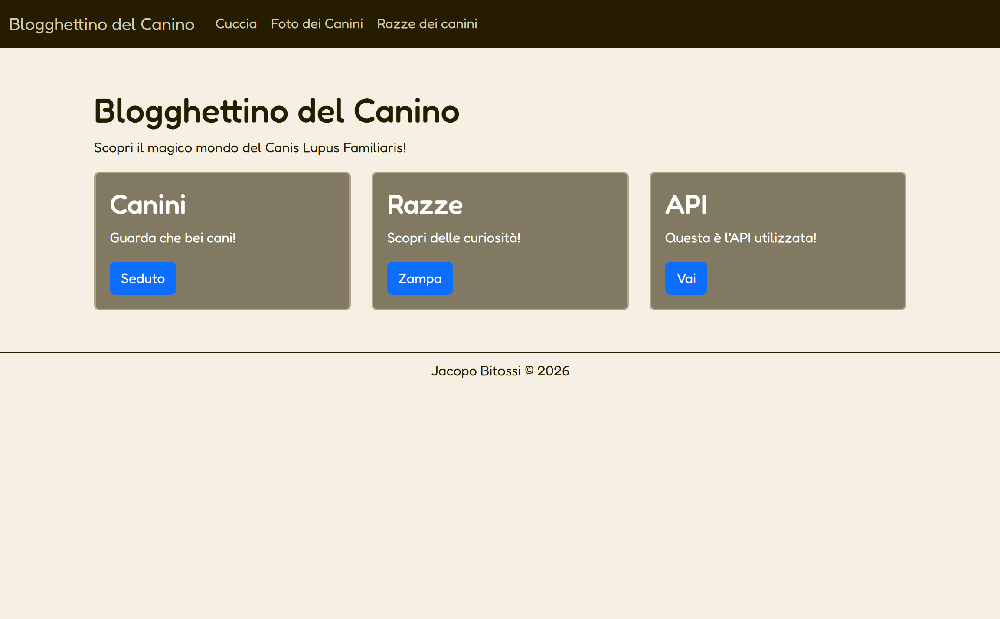
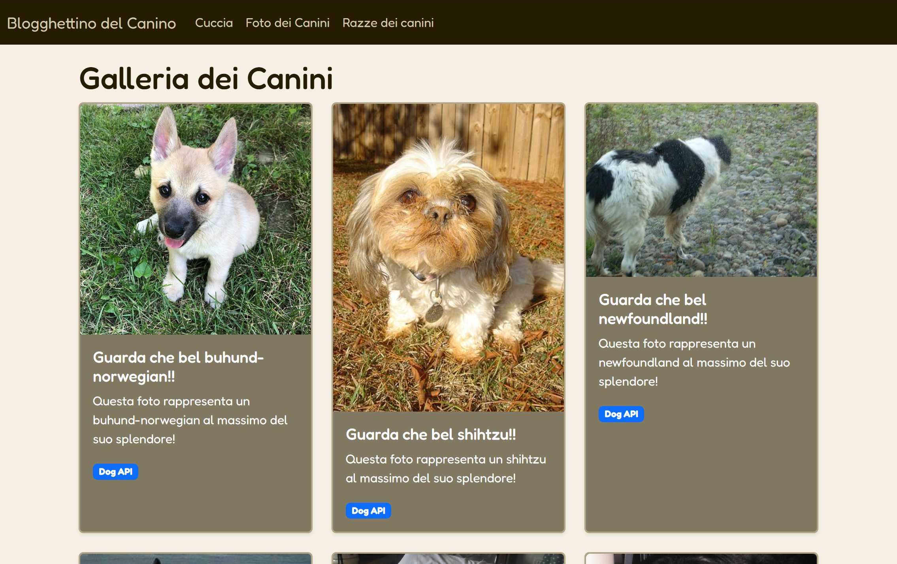
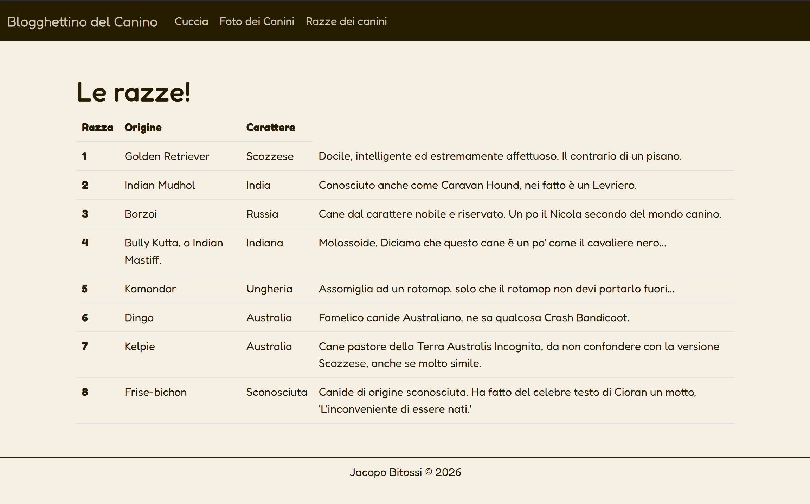

# Blogghettino del Canino
Test sito multipagina 2026.

## Screenshots




## Funzionalità
Bloghettino del Canino permette di visualizzare immagini di cani meravigliosamente randomici e migliorare la propria giornata. Ah, permette anche di aumentare il proprio sapere sui cani.

## Tecnologia usata
- HTML
- CSS & Bootstrap (per design e responsività)
- Javascript (per il fetch dei dati)
- API di Dog CEO API per i dati

## Requisiti
- Un browser moderno
- Connessione ad internet (per bootstrap e fetch su API esterne)
- git o gh per clonare la repository

## Api usata
| Risorsa | Endpoint                            | Uso nel sito              |
|---------|-------------------------------------|---------------------------|
| Foto    | https://dog.ceo/api/breeds/image/random/8 | Mostrare immagini di cani |

## La repository è cosi strutturata
```
└── 📁Galleria-razze-canine
    └── 📁assets
        └── 📁immagini
            ├── galleria.png
            ├── home.png
            ├── razze.png
    └── 📁docs
        ├── api.md
        ├── faq.md
        ├── installazione.md
    ├── .gitignore
    ├── data.json
    ├── galleria.html
    ├── index.html
    ├── LICENSE
    ├── razze.html
    ├── README.md
    ├── script.js
    ├── style.css
    └── testo_esercizio.md
```

## Documentazione
- [Sito](https://jacopo-coder.github.io/Galleria-razze-canine/)
- [Installazione](docs/installazione.md)
- [FAQ](docs/faq.md)
- [API](docs/api.md)

## Licenza
Questo progettino è distribuito con licenza [MIT](LICENSE).
Ho scelto la licenza MIT perché è la più adatta ad un progetto didattico open source come questo, poiché permette a chiunque di usare, modificare e distribuire il codice in totale libertà, mantenendo solo la paternità del progetto all'autore.

## Autore
Jacopo Bitossi